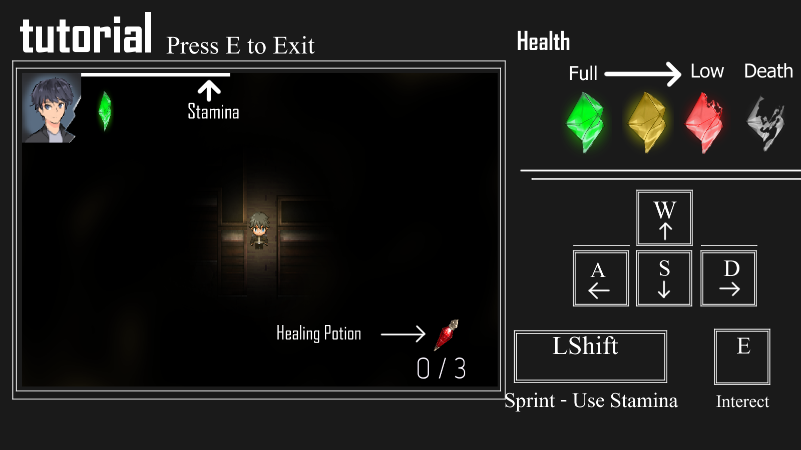
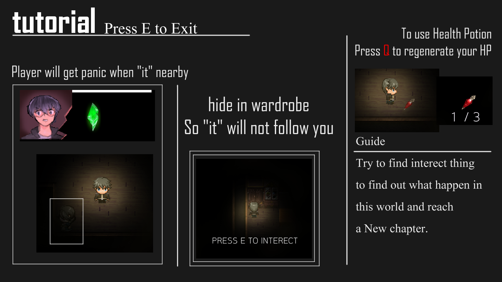

# Beyond Mirror - Game Development (Software fundamental)

## Introduction
Game development project using SFML library on C++ for 01076002 Programming Fundamental computer engineering King Mongkut's Institute of Technology Ladkrabang.
- Demo clip : https://www.youtube.com/watch?v=Mbl7fE_P_0k
- File Game (Release version base window) : https://drive.google.com/file/d/197ZsPJS9JzrFYf9cLwCKLg439YIoMMBq/view?usp=sharing

## About this game
You wake up in the middle of darkness and must find clue to get out from this nightmare and survive from the mysterious thing. While in the darkness, the only way to survive is to HIDE.

This game will have <u>3 ENDING</u> following your action. Try to find clue as much as posible and don't be afraid getting out of your "Comfort Zone"

There will be 4 Chapter
- Chapter 1 : The place
- Chapter 2 : HER
- Chapter 3 : Corrupt
- Chapter 4 : BEYOND MIRROR

Ending
- (A) FUTURE
- (B) e the man you don't want to be
- (C) an't get away with this

## Tutorial

## Product by
Chatkul Rattnarithikul
